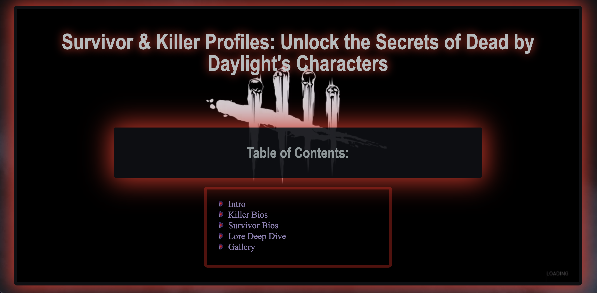

# Survivor & Killer Profiles: Unlock the Secrets of Dead by Daylight's Characters

A comprehensive React-based web application showcasing Dead by Daylight's characters, lore, and universe.



## Live Demo

Visit the live site: [Dead by Daylight Fan Page](https://katanafinkoi.github.io/Dead-By-Daylight2.0)

## About This Project

This project is a React-based remake of a static HTML Dead by Daylight fan site, transformed into a modern multi-page web application. It provides detailed information about the game's killers, survivors, and extensive lore.

### Key Features

- **Multi-page navigation** - Content separated into dedicated pages for better organization
- **Responsive design** - Optimized viewing experience across devices
- **Interactive elements** - Smooth transitions between pages
- **Rich character bios** - Detailed backstories for all killers and survivors
- **Deep lore exploration** - Comprehensive information about The Entity and The Trials

## Tech Stack

- React 18
- Vite
- React Router
- CSS3
- GitHub Pages (deployment)

## Pages

- **Home** - Introduction and overview of the game
- **Killer Bios** - Detailed profiles of each killer
- **Survivor Bios** - Background stories for all survivors
- **Lore Deep Dive** - Extensive explanation of the game's universe
- **Gallery** - Visual showcase of characters and environments

## Local Development

### Prerequisites

- Node.js (v16+)
- npm or yarn

### Setup

1. Clone the repository:
   ```bash
   git clone https://github.com/YourUsername/Dead-by-Daylight-project.git
   cd Dead-by-Daylight-project

2.  Install Dependencies:
    ```bash
    npm install
    # or
    yarn install

3.  Start the development server:
    ```bash
    npm run dev
    # or
    yarn dev
    ```
4.  Open http://localhost:5173 in your browser

### Building for Production
```bash
npm run build
# or
yarn build
```

## Implementation Details

This project represents a transition from a traditional static HTML website to a modern React application. The original content has been preserved while providing a more dynamic user experience:

- **Component-based architecture**: Each section of the original site has been converted into reusable React components
- **Client-side routing**: Using React Router for seamless navigation between pages
- **Preserved styling**: The original atmospheric aesthetic has been maintained while enhancing interactivity

## Credits

- Content based on Dead by Daylight, developed by Behaviour Interactive
- All character bios and lore are from the original game
- Special thanks to the DBD community for their passion and support

## License

This project is intended for educational and fan purposes only. Dead by Daylight and all related characters, storylines, and imagery are the property of Behaviour Interactive.

---

**Note:** This is a fan project and is not officially affiliated with Behaviour Interactive or Dead by Daylight.

